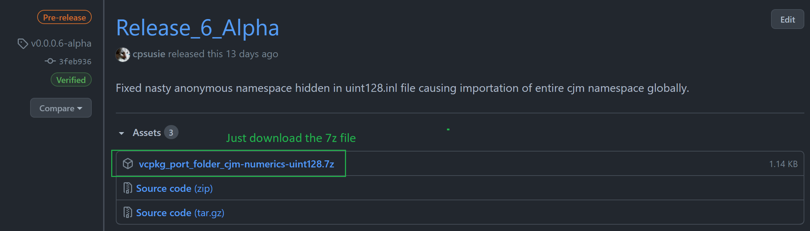
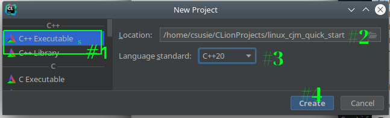
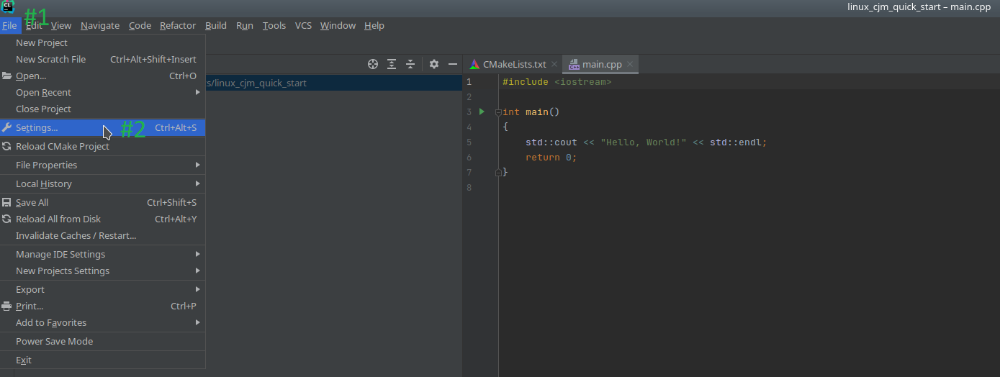
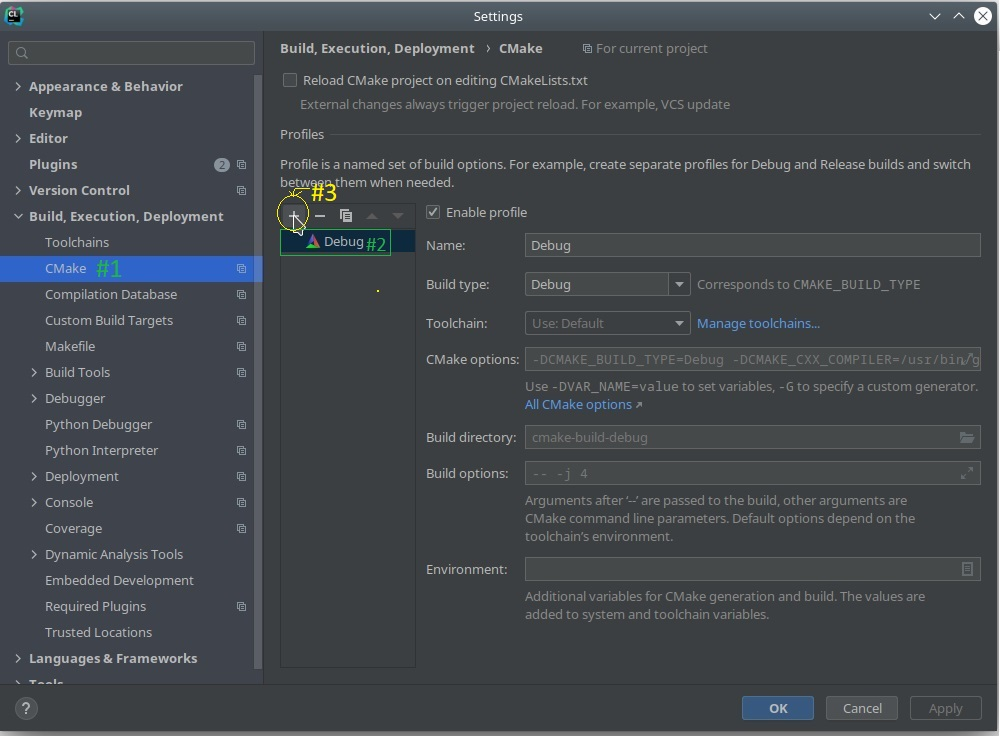
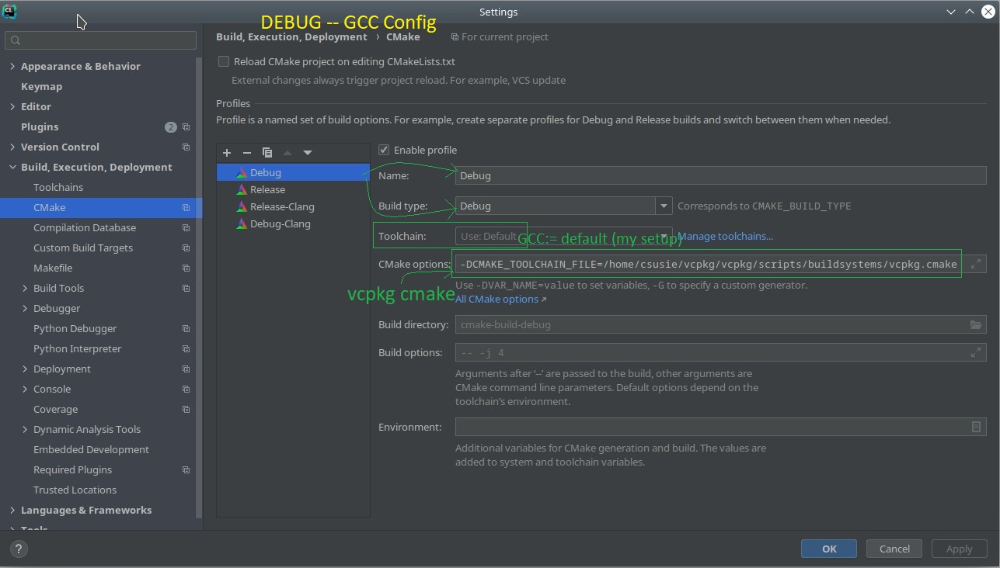
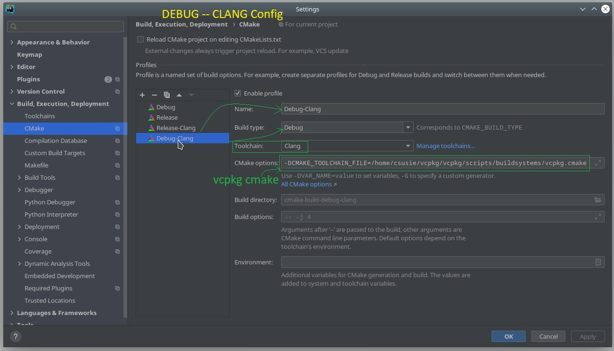
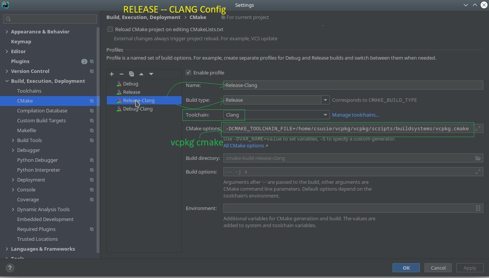
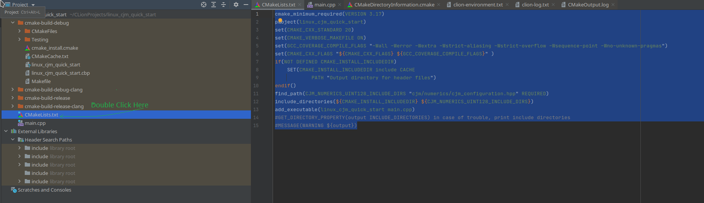
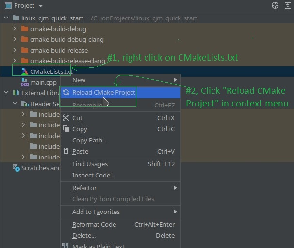
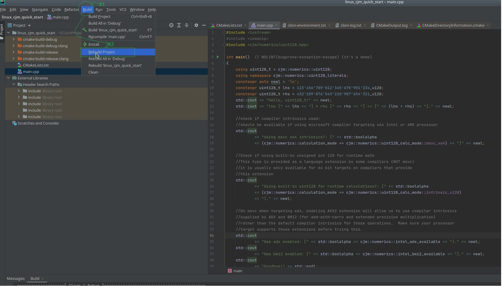

# CJM Numerics Linux/Clion Quick Start Installation Guide  
**Copyright © 2020-2021, CJM Screws, LLC**  

This guide is a walkthrough describing how to install the CJM Numerics UInt128 `C++20` Library for usage in an Intel/Amd 64 bit Linux environment.  It uses CLion as the IDE / Code editor.  CLion makes use of CMake so even if you are using a different IDE or text editor, you may be able to make some use of this guide.  

## Description of Environment  

### Operating System  

This guide was made on a Kubuntu 20.10 system with a 64-bit intel processor.  The processor supports AVX2 but not AVX512.

### Compilers and Standard Library
1.  This project will assume use of GCC 10.2.0+ as the primary compiler   
2.  Clang 11.0.0+ is used as a secondary compiler
3.  libstdc++ is used as the standard library (by both clang and gcc; note that clang's own libc++ does not yet provide full support for concepts)  

### Package Manager    

Vcpkg is used as the C++ package manager for this guide and is highly recommended.  Vcpkg is a cross-platform open-source C++ package manager published by Microsoft under a permissive license.  You can obtain vcpkg from Microsoft here (you will have to download and copy a port folder) or from my vcpkg fork here (comes with port for cjm-numerics-uint128 and some custom triplets but is otherwise idential to Microsoft's version).  Make sure you have vcpkg built and working before proceeding.  For generalized unix instructions look [here](https://github.com/microsoft/vcpkg#quick-start-unix).  Make sure you also follow the linux-specific instructions [here](https://github.com/microsoft/vcpkg#installing-linux-developer-tools). 

### IDE 
  
This guide assumes you are using CLion version 2020.3.3+.

## Downloading cjm-numerics-uint128 Port folder  

### See if the port for cjm-numerics is present already

Open up a command line terminal and navigate to the folder where you have built and installed vcpkg. Enter the following command: `./vcpkg search cjm-numerics`.  If you downloaded vcpkg from the cjm repository, the result should be:  

>csusie@ubuntu:~/vcpkg/vcpkg$ ./vcpkg search cjm-numerics  
cjm-numerics-uint128 0.0.0.6-alpha  a header-only library for C++ 20 that provides an unsigned 128-bit integer.  
If your library is not listed, please open an issue at and/or consider making a pull request:  
    https://github.com/Microsoft/vcpkg/issues  

If you downloaded vcpkg from Microsoft's repo, no library will be found and the result should be:  

>csusie@ubuntu:~/vcpkg/vcpkg$ ./vcpkg search cjm-numerics  
If your library is not listed, please open an issue at and/or consider making a pull request:  
    https://github.com/Microsoft/vcpkg/issues

### **If** the port is **not already present**, download it from github  
  
Go to the [releases page][1] of the repository and select the most recent release.  From the most recent release, you will need **only** the 7-zip file.  Vcpkg will download everything else from the repo itself.  Consult the following illustration:
  
  

Now open the archive and extract contents as shown to your vcpkg's ports folder then confirm it is prenent.   
  
  

Now when you enter `./vcpkg search cjm-numerics`, the result should be:  

> csusie@ubuntu:~/vcpkg/vcpkg$ ./vcpkg search cjm-numerics  
cjm-numerics-uint128 0.0.0.6-alpha    a header-only library for C++ 20 that provides an unsigned 128-bit integer.  

## Installing the Library  
  
Now it is time to use vcpkg to install the library.  Navigate in the command prompt to your vcpkg folder.  Then enter: `./vcpkg install cjm-numerics-uint128`.  The result should look like:  

> csusie@ubuntu:~/vcpkg/vcpkg$ ./vcpkg install cjm-numerics-uint128  
Computing installation plan...  
The following packages will be built and installed:  
    cjm-numerics-uint128[core]:x64-linux -> 0.0.0.6-alpha  
Detecting compiler hash for triplet x64-linux...  
Using cached binary package:   /home/csusie/.cache/vcpkg/archives/85/853468a55306e5d214c34f0ff1f191b07467df20.zip  
Starting package 1/1: cjm-numerics-uint128:x64-linux  
Building package cjm-numerics-uint128[core]:x64-linux...  
Building package cjm-numerics-uint128[core]:x64-linux... done  
Installing package cjm-numerics-uint128[core]:x64-linux...  
Installing package cjm-numerics-uint128[core]:x64-linux... done  
Elapsed time for package cjm-numerics-uint128:x64-linux: 10.16 ms  
Total elapsed time: 610.7 ms  
The package cjm-numerics-uint128:x64-linux is header only and can be used from CMake via:  
    find_path(CJM_NUMERICS_UINT128_INCLUDE_DIRS "cjm/numerics/cjm_configuration.hpp")  
    target_include_directories(main PRIVATE ${CJM_NUMERICS_UINT128_INCLUDE_DIRS})  
  
Entering the command `./vcpkg list cjm-numerics` should confirm installation as follows:  
  
> csusie@ubuntu:~/vcpkg/vcpkg$ ./vcpkg list cjm-numerics  
cjm-numerics-uint128:x64-linux                     0.0.0.6-alpha    a header-only library for C++ 20 that provides a...  

## Creating a Console Application in CLion to Test Installation  
  
Open Clion and choose to create a new project.  In the "New Project" popup window, 
1.  select C++ executable, 
2.  choose an appropriate name and location,
3.  set the language standard to C++20 then
4.  click the "Create" button as shown:  
  
  
  
As a result, CLion should autogenerate a "hello world" console application for you.  

### Setup Build Configuration Referencing Vcpkg's cmake file  

Once the "hello world" application is generated, click file->setting as shown:  
  

  
The "Settings" Window should appear.  First, navigate to "CMake" (#1) under "Build, Execution, Deployment" in the left-side menu-list.  You will see that the project currently has one configuration called "Debug" (#2). Note that the Toolchain for the Debug Configuration is "Use: Default".  On my setup the default toolchain is GCC.  We will be setting up three additional configurations: a Release configuration for Default/GCC, a Debug Configuration for Clang and a Release Configuration for Clang.  On your system, Clang may be default or you might have only Clang or GCC installed.  If you only have one compiler installed, ignore the instructions for the other compiler and skip those configurations.  If you have both GCC and Clang installed, but Clang is your default toolchain, adjust how you follow the instructions accordingly.  Also, please note that this C++20 library requires GCC version 10.2+ and Clang version 11.0+.  If either of your compilers does not meet those requirements, update them before continuing.  Or, just follow the instructions (adjusting accordingly) for the compliant compiler you have installed.  
  
  

In any case, you must enter the following text in the "CMake options" textbox **in each configuration, including "Debug"** to setup CLion to use vcpkg's CMake settings: `-DCMAKE_TOOLCHAIN_FILE=/home/csusie/vcpkg/vcpkg/scripts/buildsystems/vcpkg.cmake`.  When you are ready to add configurations, press the plus button (#3) until the desired number of configurations appear (these instructions assume 4 configurations).  After adding the configurations, setup each configuration as shown, ignoring or adjusting to compensate for differences between your setup and mine.  

1.  **Debug -- GCC(G++) Configuration**  
  
  
  
2.  **Release -- GCC(G++) Configuration**  
  
    
    
3.  **Debug -- Clang Configuration**  
  
   
  
4.  **Release -- Clang Configuration**  

    
  
After you have setup all your configurations, press the "Apply" then "Ok" buttons in the lower right of the settings Window.             

### Setting Up CMakeLists.txt 

Next, we will need to setup CMakeLists.txt to build our example application, use the `C++20` standard and know where to find the cjm-numerics-uint128 library.  To open up CMakeLists.txt for editing, double click on CMakeLists.txt in the left-hand project pane as shown:  

  

Then delete the current contents of the file and replace it with the following:  

```makefile
cmake_minimum_required(VERSION 3.17) #Minimum cmake version
project(linux_cjm_quick_start) #Name the test project
set(CMAKE_CXX_STANDARD 20) #Request C++20 Standard
set(CMAKE_CXX_STANDARD_REQUIRED ON) #Refuse to work if compiler does not support C++20
set(CMAKE_VERBOSE_MAKEFILE ON) #Make Verbose log ... help if there are problems.

set(GCC_COVERAGE_COMPILE_FLAGS "-Wall -Werror -Wextra -Wstrict-aliasing -Wstrict-overflow -Wsequence-point -Wno-unknown-pragmas")
#Set up healthy errors requiring standards-conforming code, disable unknown pragma warnings (for now).

set(CMAKE_CXX_FLAGS "${CMAKE_CXX_FLAGS} ${GCC_COVERAGE_COMPILE_FLAGS}" ) #set flags appropriately

if(NOT DEFINED CMAKE_INSTALL_INCLUDEDIR)
    SET(CMAKE_INSTALL_INCLUDEDIR include CACHE
            PATH "Output directory for header files")
endif() #find vcpkg's include directory if it's not already

find_path(CJM_NUMERICS_UINT128_INCLUDE_DIRS "cjm/numerics/cjm_configuration.hpp" REQUIRED) #find cjm numerics include folder

include_directories(${CMAKE_INSTALL_INCLUDEDIR} ${CJM_NUMERICS_UINT128_INCLUDE_DIRS}) #include appropriate folders

add_executable(linux_cjm_quick_start main.cpp) #compile main.cpp as executable

#GET_DIRECTORY_PROPERTY(output INCLUDE_DIRECTORIES) #in case of trouble, print include directories
#MESSAGE(WARNING ${output})
```  
After entering the above code, CLion should let you know that the project needs to be reloaded by showing a blue notice box on top of the CMakeLists.txt file as shown:  

  

Click reload as above.  If for some reason this box does not appear after editing the file, you can cause the reload by right-clicking on CMakeLists.txt in the left-hand project panel, then choosing "Reload CMake Project" in the context menu as shown:  
  
  

After reloading the CMake project by one of the options suggested below, something like the following should appear in the CMake log:  

```
/home/csusie/Clion_Install/clion-2020.3.2/bin/cmake/linux/bin/cmake -DCMAKE_BUILD_TYPE=Debug -DCMAKE_CXX_COMPILER=/usr/bin/g++ -DCMAKE_TOOLCHAIN_FILE=/home/csusie/vcpkg/vcpkg/scripts/buildsystems/vcpkg.cmake -G "CodeBlocks - Unix Makefiles" /home/csusie/CLionProjects/linux_cjm_quick_start
-- Configuring done
-- Generating done
-- Build files have been written to: /home/csusie/CLionProjects/linux_cjm_quick_start/cmake-build-debug

[Finished]

```
## Entering the Code  

Next, open main.cpp (found in the left-hand project pane).  Replace the default "Hello, world!" with the following: 

```cpp
#include <iostream>
#include <iomanip>
#include <cjm/numerics/uint128.hpp>

int main()  // NOLINT(bugprone-exception-escape) (it's a demo)
{
	using uint128_t = cjm::numerics::uint128;
	using namespace cjm::numerics::uint128_literals;
	constexpr auto newl = '\n';
	constexpr uint128_t lhs = 123'456'789'012'345'678'901'234_u128;
	constexpr uint128_t rhs = 432'109'876'543'210'987'654'321_u128;
	std::cout << "Hello, uint128_t!" << newl;
	std::cout << "lhs [" << lhs << "] * rhs [" << rhs << "] == [" << (lhs * rhs) << "]." << newl;

	//check if compiler intrinsics used:
	//should be available if using microsoft compiler targeting x64 Intel or AMD processor
	std::cout
		<< "Using msvc x64 intrinsics?: [" << std::boolalpha
		<< (cjm::numerics::calculation_mode == cjm::numerics::uint128_calc_mode::msvc_x64) << "]" << newl;

	//Check if using built-in unsigned int 128 for runtime math
	//This type is provided as a language extension by some compilers (NOT msvc)
	//it is usually only available for 64 bit targets on compilers that provide
	//this extension
	std::cout
		<< "Using built-in uint128 for runtime calculations?: [" << std::boolalpha
		<< (cjm::numerics::calculation_mode == cjm::numerics::uint128_calc_mode::intrinsic_u128)
		<< "]." << newl;
	
	//On msvc when targeting x64, enabling AVX2 extension will allow us to use compiler intrinsics
	//supplied by ADX and BMI2 (for add-with-carry and extended precision multiplication)
	//rather than the default compiler intrinsics for those operations.  Make sure your processor
	//target supports those extensions before trying this.
	std::cout
		<< "Has adx enabled: [" << std::boolalpha << cjm::numerics::intel_adx_available << "]." << newl;
	std::cout
		<< "Has bmi2 enabled: [" << std::boolalpha << cjm::numerics::intel_bmi2_available << "]." << newl;
	std::cout
		<< "Goodbye!" << std::endl;
	return 0;
}
```  

This code can also be found in the GitHub repository [here][2].

## Building the Project  

It is now time to build the project.  To rebuild for all configurations, click on Build in the menu bar and select "Rebuild Project" in the drop-down as shown:  


  
The project should be built for all your configurations, with the build log at the bottom reflecting success with something similar to the following:  

```bash
====================[ Build | all | Debug ]=====================================
/home/csusie/Clion_Install/clion-2020.3.2/bin/cmake/linux/bin/cmake --build /home/csusie/CLionProjects/linux_cjm_quick_start/cmake-build-debug --target all -- -j 4
/home/csusie/Clion_Install/clion-2020.3.2/bin/cmake/linux/bin/cmake -S/home/csusie/CLionProjects/linux_cjm_quick_start -B/home/csusie/CLionProjects/linux_cjm_quick_start/cmake-build-debug --check-build-system CMakeFiles/Makefile.cmake 0
/home/csusie/Clion_Install/clion-2020.3.2/bin/cmake/linux/bin/cmake -E cmake_progress_start /home/csusie/CLionProjects/linux_cjm_quick_start/cmake-build-debug/CMakeFiles /home/csusie/CLionProjects/linux_cjm_quick_start/cmake-build-debug/CMakeFiles/progress.marks
/usr/bin/gmake  -f CMakeFiles/Makefile2 all
gmake[1]: Entering directory '/home/csusie/CLionProjects/linux_cjm_quick_start/cmake-build-debug'
/usr/bin/gmake  -f CMakeFiles/linux_cjm_quick_start.dir/build.make CMakeFiles/linux_cjm_quick_start.dir/depend
gmake[2]: Entering directory '/home/csusie/CLionProjects/linux_cjm_quick_start/cmake-build-debug'
cd /home/csusie/CLionProjects/linux_cjm_quick_start/cmake-build-debug && /home/csusie/Clion_Install/clion-2020.3.2/bin/cmake/linux/bin/cmake -E cmake_depends "Unix Makefiles" /home/csusie/CLionProjects/linux_cjm_quick_start /home/csusie/CLionProjects/linux_cjm_quick_start /home/csusie/CLionProjects/linux_cjm_quick_start/cmake-build-debug /home/csusie/CLionProjects/linux_cjm_quick_start/cmake-build-debug /home/csusie/CLionProjects/linux_cjm_quick_start/cmake-build-debug/CMakeFiles/linux_cjm_quick_start.dir/DependInfo.cmake --color=
Scanning dependencies of target linux_cjm_quick_start
gmake[2]: Leaving directory '/home/csusie/CLionProjects/linux_cjm_quick_start/cmake-build-debug'
/usr/bin/gmake  -f CMakeFiles/linux_cjm_quick_start.dir/build.make CMakeFiles/linux_cjm_quick_start.dir/build
gmake[2]: Entering directory '/home/csusie/CLionProjects/linux_cjm_quick_start/cmake-build-debug'
[ 50%] Building CXX object CMakeFiles/linux_cjm_quick_start.dir/main.cpp.o
/usr/bin/g++   -I/home/csusie/CLionProjects/linux_cjm_quick_start/include -I/home/csusie/vcpkg/vcpkg/installed/x64-linux/include  -Wall -Werror -Wextra -Wstrict-aliasing -Wstrict-overflow -Wsequence-point -Wno-unknown-pragmas -g   -std=gnu++2a -o CMakeFiles/linux_cjm_quick_start.dir/main.cpp.o -c /home/csusie/CLionProjects/linux_cjm_quick_start/main.cpp
[100%] Linking CXX executable linux_cjm_quick_start
/home/csusie/Clion_Install/clion-2020.3.2/bin/cmake/linux/bin/cmake -E cmake_link_script CMakeFiles/linux_cjm_quick_start.dir/link.txt --verbose=1
/usr/bin/g++   -Wall -Werror -Wextra -Wstrict-aliasing -Wstrict-overflow -Wsequence-point -Wno-unknown-pragmas -g   CMakeFiles/linux_cjm_quick_start.dir/main.cpp.o  -o linux_cjm_quick_start 
gmake[2]: Leaving directory '/home/csusie/CLionProjects/linux_cjm_quick_start/cmake-build-debug'
[100%] Built target linux_cjm_quick_start
gmake[1]: Leaving directory '/home/csusie/CLionProjects/linux_cjm_quick_start/cmake-build-debug'
/home/csusie/Clion_Install/clion-2020.3.2/bin/cmake/linux/bin/cmake -E cmake_progress_start /home/csusie/CLionProjects/linux_cjm_quick_start/cmake-build-debug/CMakeFiles 0

Build finished

====================[ Build | all | Debug-Clang ]===============================
/home/csusie/Clion_Install/clion-2020.3.2/bin/cmake/linux/bin/cmake --build /home/csusie/CLionProjects/linux_cjm_quick_start/cmake-build-debug-clang --target all -- -j 4
/home/csusie/Clion_Install/clion-2020.3.2/bin/cmake/linux/bin/cmake -S/home/csusie/CLionProjects/linux_cjm_quick_start -B/home/csusie/CLionProjects/linux_cjm_quick_start/cmake-build-debug-clang --check-build-system CMakeFiles/Makefile.cmake 0
/home/csusie/Clion_Install/clion-2020.3.2/bin/cmake/linux/bin/cmake -E cmake_progress_start /home/csusie/CLionProjects/linux_cjm_quick_start/cmake-build-debug-clang/CMakeFiles /home/csusie/CLionProjects/linux_cjm_quick_start/cmake-build-debug-clang/CMakeFiles/progress.marks
/usr/bin/gmake  -f CMakeFiles/Makefile2 all
gmake[1]: Entering directory '/home/csusie/CLionProjects/linux_cjm_quick_start/cmake-build-debug-clang'
/usr/bin/gmake  -f CMakeFiles/linux_cjm_quick_start.dir/build.make CMakeFiles/linux_cjm_quick_start.dir/depend
gmake[2]: Entering directory '/home/csusie/CLionProjects/linux_cjm_quick_start/cmake-build-debug-clang'
cd /home/csusie/CLionProjects/linux_cjm_quick_start/cmake-build-debug-clang && /home/csusie/Clion_Install/clion-2020.3.2/bin/cmake/linux/bin/cmake -E cmake_depends "Unix Makefiles" /home/csusie/CLionProjects/linux_cjm_quick_start /home/csusie/CLionProjects/linux_cjm_quick_start /home/csusie/CLionProjects/linux_cjm_quick_start/cmake-build-debug-clang /home/csusie/CLionProjects/linux_cjm_quick_start/cmake-build-debug-clang /home/csusie/CLionProjects/linux_cjm_quick_start/cmake-build-debug-clang/CMakeFiles/linux_cjm_quick_start.dir/DependInfo.cmake --color=
Scanning dependencies of target linux_cjm_quick_start
gmake[2]: Leaving directory '/home/csusie/CLionProjects/linux_cjm_quick_start/cmake-build-debug-clang'
/usr/bin/gmake  -f CMakeFiles/linux_cjm_quick_start.dir/build.make CMakeFiles/linux_cjm_quick_start.dir/build
gmake[2]: Entering directory '/home/csusie/CLionProjects/linux_cjm_quick_start/cmake-build-debug-clang'
[ 50%] Building CXX object CMakeFiles/linux_cjm_quick_start.dir/main.cpp.o
/usr/bin/clang++   -I/home/csusie/CLionProjects/linux_cjm_quick_start/include -I/home/csusie/vcpkg/vcpkg/installed/x64-linux/include  -Wall -Werror -Wextra -Wstrict-aliasing -Wstrict-overflow -Wsequence-point -Wno-unknown-pragmas -g   -std=gnu++2a -o CMakeFiles/linux_cjm_quick_start.dir/main.cpp.o -c /home/csusie/CLionProjects/linux_cjm_quick_start/main.cpp
[100%] Linking CXX executable linux_cjm_quick_start
/home/csusie/Clion_Install/clion-2020.3.2/bin/cmake/linux/bin/cmake -E cmake_link_script CMakeFiles/linux_cjm_quick_start.dir/link.txt --verbose=1
/usr/bin/clang++   -Wall -Werror -Wextra -Wstrict-aliasing -Wstrict-overflow -Wsequence-point -Wno-unknown-pragmas -g   CMakeFiles/linux_cjm_quick_start.dir/main.cpp.o  -o linux_cjm_quick_start 
gmake[2]: Leaving directory '/home/csusie/CLionProjects/linux_cjm_quick_start/cmake-build-debug-clang'
[100%] Built target linux_cjm_quick_start
gmake[1]: Leaving directory '/home/csusie/CLionProjects/linux_cjm_quick_start/cmake-build-debug-clang'
/home/csusie/Clion_Install/clion-2020.3.2/bin/cmake/linux/bin/cmake -E cmake_progress_start /home/csusie/CLionProjects/linux_cjm_quick_start/cmake-build-debug-clang/CMakeFiles 0

Build finished

====================[ Build | all | Release ]===================================
/home/csusie/Clion_Install/clion-2020.3.2/bin/cmake/linux/bin/cmake --build /home/csusie/CLionProjects/linux_cjm_quick_start/cmake-build-release --target all -- -j 4
/home/csusie/Clion_Install/clion-2020.3.2/bin/cmake/linux/bin/cmake -S/home/csusie/CLionProjects/linux_cjm_quick_start -B/home/csusie/CLionProjects/linux_cjm_quick_start/cmake-build-release --check-build-system CMakeFiles/Makefile.cmake 0
/home/csusie/Clion_Install/clion-2020.3.2/bin/cmake/linux/bin/cmake -E cmake_progress_start /home/csusie/CLionProjects/linux_cjm_quick_start/cmake-build-release/CMakeFiles /home/csusie/CLionProjects/linux_cjm_quick_start/cmake-build-release/CMakeFiles/progress.marks
/usr/bin/gmake  -f CMakeFiles/Makefile2 all
gmake[1]: Entering directory '/home/csusie/CLionProjects/linux_cjm_quick_start/cmake-build-release'
/usr/bin/gmake  -f CMakeFiles/linux_cjm_quick_start.dir/build.make CMakeFiles/linux_cjm_quick_start.dir/depend
gmake[2]: Entering directory '/home/csusie/CLionProjects/linux_cjm_quick_start/cmake-build-release'
cd /home/csusie/CLionProjects/linux_cjm_quick_start/cmake-build-release && /home/csusie/Clion_Install/clion-2020.3.2/bin/cmake/linux/bin/cmake -E cmake_depends "Unix Makefiles" /home/csusie/CLionProjects/linux_cjm_quick_start /home/csusie/CLionProjects/linux_cjm_quick_start /home/csusie/CLionProjects/linux_cjm_quick_start/cmake-build-release /home/csusie/CLionProjects/linux_cjm_quick_start/cmake-build-release /home/csusie/CLionProjects/linux_cjm_quick_start/cmake-build-release/CMakeFiles/linux_cjm_quick_start.dir/DependInfo.cmake --color=
Scanning dependencies of target linux_cjm_quick_start
gmake[2]: Leaving directory '/home/csusie/CLionProjects/linux_cjm_quick_start/cmake-build-release'
/usr/bin/gmake  -f CMakeFiles/linux_cjm_quick_start.dir/build.make CMakeFiles/linux_cjm_quick_start.dir/build
gmake[2]: Entering directory '/home/csusie/CLionProjects/linux_cjm_quick_start/cmake-build-release'
[ 50%] Building CXX object CMakeFiles/linux_cjm_quick_start.dir/main.cpp.o
/usr/bin/g++   -I/home/csusie/CLionProjects/linux_cjm_quick_start/include -I/home/csusie/vcpkg/vcpkg/installed/x64-linux/include  -Wall -Werror -Wextra -Wstrict-aliasing -Wstrict-overflow -Wsequence-point -Wno-unknown-pragmas -O3 -DNDEBUG   -std=gnu++2a -o CMakeFiles/linux_cjm_quick_start.dir/main.cpp.o -c /home/csusie/CLionProjects/linux_cjm_quick_start/main.cpp
[100%] Linking CXX executable linux_cjm_quick_start
/home/csusie/Clion_Install/clion-2020.3.2/bin/cmake/linux/bin/cmake -E cmake_link_script CMakeFiles/linux_cjm_quick_start.dir/link.txt --verbose=1
/usr/bin/g++   -Wall -Werror -Wextra -Wstrict-aliasing -Wstrict-overflow -Wsequence-point -Wno-unknown-pragmas -O3 -DNDEBUG   CMakeFiles/linux_cjm_quick_start.dir/main.cpp.o  -o linux_cjm_quick_start 
gmake[2]: Leaving directory '/home/csusie/CLionProjects/linux_cjm_quick_start/cmake-build-release'
[100%] Built target linux_cjm_quick_start
gmake[1]: Leaving directory '/home/csusie/CLionProjects/linux_cjm_quick_start/cmake-build-release'
/home/csusie/Clion_Install/clion-2020.3.2/bin/cmake/linux/bin/cmake -E cmake_progress_start /home/csusie/CLionProjects/linux_cjm_quick_start/cmake-build-release/CMakeFiles 0

Build finished

====================[ Build | all | Release-Clang ]=============================
/home/csusie/Clion_Install/clion-2020.3.2/bin/cmake/linux/bin/cmake --build /home/csusie/CLionProjects/linux_cjm_quick_start/cmake-build-release-clang --target all -- -j 4
/home/csusie/Clion_Install/clion-2020.3.2/bin/cmake/linux/bin/cmake -S/home/csusie/CLionProjects/linux_cjm_quick_start -B/home/csusie/CLionProjects/linux_cjm_quick_start/cmake-build-release-clang --check-build-system CMakeFiles/Makefile.cmake 0
/home/csusie/Clion_Install/clion-2020.3.2/bin/cmake/linux/bin/cmake -E cmake_progress_start /home/csusie/CLionProjects/linux_cjm_quick_start/cmake-build-release-clang/CMakeFiles /home/csusie/CLionProjects/linux_cjm_quick_start/cmake-build-release-clang/CMakeFiles/progress.marks
/usr/bin/gmake  -f CMakeFiles/Makefile2 all
gmake[1]: Entering directory '/home/csusie/CLionProjects/linux_cjm_quick_start/cmake-build-release-clang'
/usr/bin/gmake  -f CMakeFiles/linux_cjm_quick_start.dir/build.make CMakeFiles/linux_cjm_quick_start.dir/depend
gmake[2]: Entering directory '/home/csusie/CLionProjects/linux_cjm_quick_start/cmake-build-release-clang'
cd /home/csusie/CLionProjects/linux_cjm_quick_start/cmake-build-release-clang && /home/csusie/Clion_Install/clion-2020.3.2/bin/cmake/linux/bin/cmake -E cmake_depends "Unix Makefiles" /home/csusie/CLionProjects/linux_cjm_quick_start /home/csusie/CLionProjects/linux_cjm_quick_start /home/csusie/CLionProjects/linux_cjm_quick_start/cmake-build-release-clang /home/csusie/CLionProjects/linux_cjm_quick_start/cmake-build-release-clang /home/csusie/CLionProjects/linux_cjm_quick_start/cmake-build-release-clang/CMakeFiles/linux_cjm_quick_start.dir/DependInfo.cmake --color=
Scanning dependencies of target linux_cjm_quick_start
gmake[2]: Leaving directory '/home/csusie/CLionProjects/linux_cjm_quick_start/cmake-build-release-clang'
/usr/bin/gmake  -f CMakeFiles/linux_cjm_quick_start.dir/build.make CMakeFiles/linux_cjm_quick_start.dir/build
gmake[2]: Entering directory '/home/csusie/CLionProjects/linux_cjm_quick_start/cmake-build-release-clang'
[ 50%] Building CXX object CMakeFiles/linux_cjm_quick_start.dir/main.cpp.o
/usr/bin/clang++   -I/home/csusie/CLionProjects/linux_cjm_quick_start/include -I/home/csusie/vcpkg/vcpkg/installed/x64-linux/include  -Wall -Werror -Wextra -Wstrict-aliasing -Wstrict-overflow -Wsequence-point -Wno-unknown-pragmas -O3 -DNDEBUG   -std=gnu++2a -o CMakeFiles/linux_cjm_quick_start.dir/main.cpp.o -c /home/csusie/CLionProjects/linux_cjm_quick_start/main.cpp
[100%] Linking CXX executable linux_cjm_quick_start
/home/csusie/Clion_Install/clion-2020.3.2/bin/cmake/linux/bin/cmake -E cmake_link_script CMakeFiles/linux_cjm_quick_start.dir/link.txt --verbose=1
/usr/bin/clang++   -Wall -Werror -Wextra -Wstrict-aliasing -Wstrict-overflow -Wsequence-point -Wno-unknown-pragmas -O3 -DNDEBUG   CMakeFiles/linux_cjm_quick_start.dir/main.cpp.o  -o linux_cjm_quick_start 
gmake[2]: Leaving directory '/home/csusie/CLionProjects/linux_cjm_quick_start/cmake-build-release-clang'
[100%] Built target linux_cjm_quick_start
gmake[1]: Leaving directory '/home/csusie/CLionProjects/linux_cjm_quick_start/cmake-build-release-clang'
/home/csusie/Clion_Install/clion-2020.3.2/bin/cmake/linux/bin/cmake -E cmake_progress_start /home/csusie/CLionProjects/linux_cjm_quick_start/cmake-build-release-clang/CMakeFiles 0

Build finished
```

## Run the Project

Set the project to Release or Release-Clang then run it or them.  Your results should be something like what appears below.  

1. Release -- GCC  

```bash
/home/csusie/CLionProjects/linux_cjm_quick_start/cmake-build-release/linux_cjm_quick_start
Hello, uint128_t!
lhs [123456789012345678901234] * rhs [432109876543210987654321] == [226810394222294446283585782734362836562].
Using msvc x64 intrinsics?: [false]
Using built-in uint128 for runtime calculations?: [true].
Has adx enabled: [false].
Has bmi2 enabled: [false].
Goodbye!

Process finished with exit code 0
```
2. Release -- Clang  
```bash
/home/csusie/CLionProjects/linux_cjm_quick_start/cmake-build-release-clang/linux_cjm_quick_start
Hello, uint128_t!
lhs [123456789012345678901234] * rhs [432109876543210987654321] == [226810394222294446283585782734362836562].
Using msvc x64 intrinsics?: [false]
Using built-in uint128 for runtime calculations?: [true].
Has adx enabled: [false].
Has bmi2 enabled: [false].
Goodbye!

Process finished with exit code 0
```
Normally, in a 64-bit linux environment, GCC and Clang should have a built-in unsigned int128 available.  If it is available (as in the example output), "Using built-in uint128 for runtime calculations?:" should come out as *true*.  cjm-numerics-uint128 delegates and uses the arithmetic of that type when possible -- for runtime calculations.  Our uint128_t should be bit-pattern compatible with the built-in version (same size, alignment and endian bit-order).  Thus, the two types are [bit_castable][3] to and from each other.  If your version of the C++ standard library does not support bit-casting yet, we provide [an equivalent that will delegate to the standard library version if available or provide its own equivalent operation if not available.][4]  Note that the non-standard version is not *constexpr* capable.  

If, you are on a 64-bit system (this library is only tested for x64 on linux but *should* work in 32-bit linux as well; note however that built-in 128 bit integers are not provided by GCC or Clang for x86), but, for some reason the built-in uint128 is not available, check whether GCC is set to GNU mode.  Outside of GNU mode, the 128 bit integer is limited.  See a discussion of this topic [here.][5]  If you would like support for the built-in arithmetic enabled on GCC in non-GNU mode, open an issue.  
  
### Note on ADX, BMI2 and Enhanced Instruction Sets 
  
Windows does not provide any built-in int128 capabilities.  Thus, for Windows, compiler intrinsics are used for many of the calculations if executed at runtime.  More recent (approximately 2013-2014) Intel and (on a more limited and recent basis) AMD processors provide more efficient [add-with-carry and extended precision multiply operations on 64 bit systems.][6]  If those technologies are explicitly enabled, this library will use intrinsics that call the more efficient versions of the operations.  Thus, what ADX and BMI indicate in the output is whether *on Windows* those intrinsics are used for runtime computations.  
  
Outside of Windows, these intrinsics are not (directly) used by this library as we use the compiler built-in 128 bit operations instead.  On Linux, therefore, ADX and BMI2 will always show up as false in the run output, *even if those operations are enabled.*  If those operations are enabled however GCC and Clang *may* emit more efficient code (either currently or in the future).  Therefore, if it is possible, you should enable these instructions as long as all your [target architectures support them.][7]  Even if you enable them, the output of the example code will still say false, because that refers to whether they library itself directly uses the more efficient intrinsic operations.  
  
### Optional -- Enabling ADX, BMI2 and AVX2 or AVX512  
  
Even though the library relies on the compiler's built-in int128 to emit the most efficient code possible rather than using assembly instructions directly, you may wish to enable these technologies if all your target architectures support it.  Most Intel and some AMD processors (when operating in 64-bit mode) support [ADX][8], [BMI2][9] and [AVX2][10].  Fewer processors support [AVX512][11]. 
  
To enable ADX, BMI2 and AVX2, replace the following line from CMakeLists.txt 

```makefile
set(GCC_COVERAGE_COMPILE_FLAGS "-Wall -Werror -Wextra -Wstrict-aliasing -Wstrict-overflow -Wsequence-point -Wno-unknown-pragmas")
```
with  

```makefile
set(GCC_COVERAGE_COMPILE_FLAGS "-Wall -Werror -Wextra -Wstrict-aliasing -Wstrict-overflow -Wsequence-point -Wno-unknown-pragmas -madx -mbmi2 -mavx2")
```  
Again, it will enable the compiler to use the instructions from those sets if it deems it appropriate; it will not, however, force use of those features as it will in Windows.   

AVX512 has many separately enableable instruction sets and since I have no way to test the library with them enabled, I will leave enabling AVX512 as an exercise for the reader.  

## Conclusion

You should now know how to install this library using vcpkg then use it from CLion (with CMake) on a 64-bit Linux environment.  

  [1]: https://github.com/cpsusie/cjm-numerics/releases
  [2]: https://github.com/cpsusie/cjm-numerics/blob/main/pre_release_quick_start/pre_release_quick_start/pre_release_quick_start.cpp
  [3]: https://en.cppreference.com/w/cpp/numeric/bit_cast
  [4]: https://github.com/cpsusie/cjm-numerics/blob/78fa5e323ba1d0c6be561e0e84885d98e5f22b13/src/include/cjm/numerics/numerics.hpp#L53
  [5]: https://quuxplusone.github.io/blog/2019/02/28/is-int128-integral/
  [6]: https://www.intel.com/content/dam/www/public/us/en/documents/white-papers/ia-large-integer-arithmetic-paper.pdf
  [7]: https://en.wikipedia.org/wiki/Bit_manipulation_instruction_set#BMI2
  [8]: https://en.wikipedia.org/wiki/Intel_ADX
  [9]: https://en.wikipedia.org/wiki/Bit_manipulation_instruction_set#BMI2
  [10]: https://en.wikipedia.org/wiki/Advanced_Vector_Extensions#CPUs_with_AVX2
  [11]: https://en.wikipedia.org/wiki/AVX-512#CPUs_with_AVX-512
