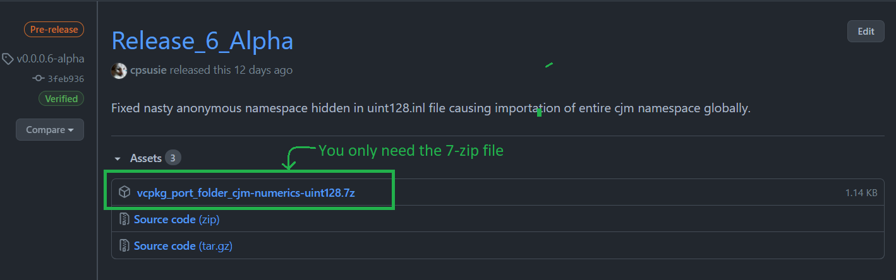
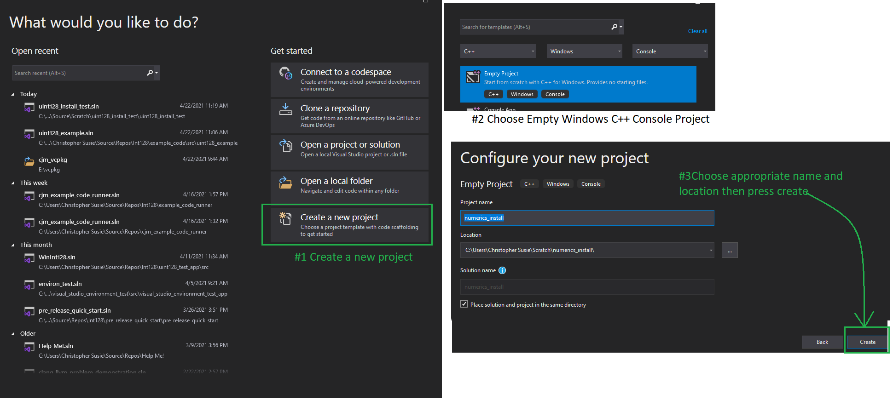
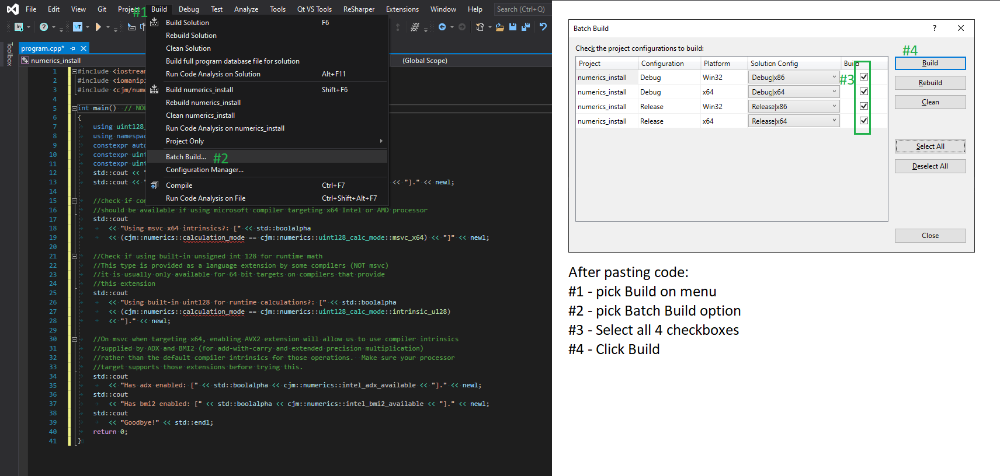
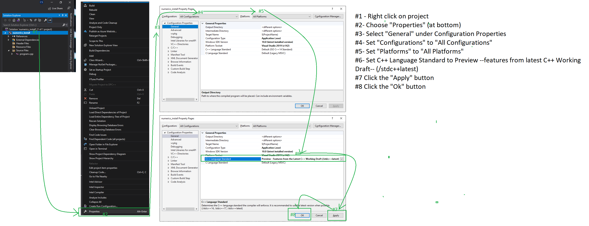
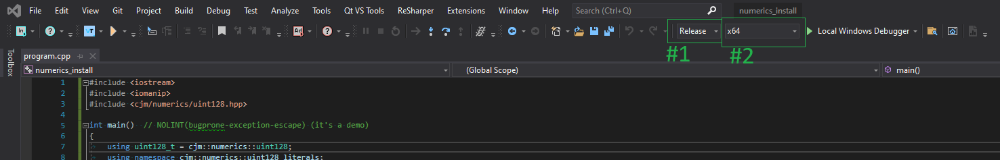
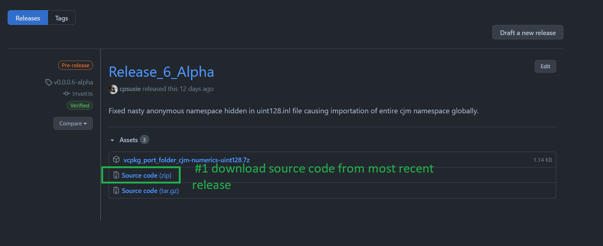

# CJM Numerics Visual Studio 2019 (19.28+ / 16.9.3+) Quick Start Installation Guide
**Copyright © 2020-2021, CJM Screws, LLC**

This guide provides a walkthrough on how to install this CJM Numerics UInt128 Library for usage with Visual Studio 2019.  It may also apply, with a few variations, to Visual Studio Code.  Please note that this project requires using a C++ compiler that supports C++20.  For Microsoft's compiler, the minimum version is 16.9.3.  

There are two different avenues for installing this header-only library:  
1. Using vcpkg (recommended).
2. Copying the library files to a system include folder used by your environment.

## Installation Using Vcpkg

Vcpkg is a permissively licensed open-source package management system published by Microsoft.  It works on Windows, Mac and Linux and provides some limited support for other platforms.  You can get vcpkg from Microsoft's repository [here][1].  If you use Microsoft's repository, after following Microsoft's instructions and installing vcpkg and integrating it with Visual Studio (or Visual Studio Code), you must download the vcpkg port folder from [the latest cjm-numerics-uint128 release.][2]  You only need the 7-zip file.  Vcpkg will download the needed files from the repo for you.  



Alternatively you can download vcpkg from my fork of their repository [here][3].  This fork is identical to Microsoft's except it comes with the port for cjm-numerics-uint128.  Once I publish a stable release of this library, I will apply to have this library included in Microsoft's repository.  
  
### Copying Port Folder  

Assuming, you downloaded vcpkg from Microsoft's repository and have downloaded the port for this library, copy it to vcpkg's ports folder as shown:  
  


### Install the Package  

Before following these steps, make sure you have copied over the port folder as shown above and [integrated vcpkg with Visual Studio.][4]  Navigate to your root vcpkg folder in powershell or a DOS prompt then, to install cjm-numerics-uint128 for x64 windows enter: `./vcpkg install cjm-numerics-uint128:x64-windows`. You should see something like the following as a result:  

> PS D:\Users\csusie\source\repos\vcpkg> .\vcpkg.exe install cjm-numerics-uint128:x64-windows  
Computing installation plan...  
The following packages will be built and installed:  
    cjm-numerics-uint128[core]:x64-windows -> 0.0.0.6-alpha  
Detecting compiler hash for triplet x64-windows...  
Could not locate cached archive:   D:\Users\csusie\AppData\Local\vcpkg\archives\b6\b609669426fc2b682e067bf2842f46761a28d26f.zip  
Starting package 1/1: cjm-numerics-uint128:x64-windows  
Building package cjm-numerics-uint128[core]:x64-windows...  
-- Using cached D:/Users/csusie/source/repos/vcpkg/downloads/cpsusie-cjm-numerics-v0.0.0.6-alpha.tar.gz  
-- Cleaning sources at D:/Users/csusie/source/repos/vcpkg/buildtrees/cjm-numerics-uint128/src/.0.6-alpha-e994768164.clean. Use --editable to skip cleaning for the packages you specify.  
-- Extracting source D:/Users/csusie/source/repos/vcpkg/downloads/cpsusie-cjm-numerics-v0.0.0.6-alpha.tar.gz  
-- Using source at D:/Users/csusie/source/repos/vcpkg/buildtrees/cjm-numerics-uint128/src/.0.6-alpha-e994768164.clean  
-- Found external ninja('1.10.2').  
-- Configuring x64-windows  
-- Up-to-date: D:/Users/csusie/source/repos/vcpkg/packages/cjm-numerics-uint128_x64-windows/include/  
-- Installing: D:/Users/csusie/source/repos/vcpkg/packages/cjm-numerics-uint128_x64-windows/include//cjm  
-- Installing: D:/Users/csusie/source/repos/vcpkg/packages/cjm-numerics-uint128_x64-windows/include//cjm/numerics  
-- Installing: D:/Users/csusie/source/repos/vcpkg/packages/cjm-numerics-uint128_x64-windows/include//cjm/numerics/cjm_configuration.hpp  
-- Installing: D:/Users/csusie/source/repos/vcpkg/packages/cjm-numerics-uint128_x64-windows/include//cjm/numerics/cjm_numeric_concepts.hpp  
-- Installing: D:/Users/csusie/source/repos/vcpkg/packages/cjm-numerics-uint128_x64-windows/include//cjm/numerics/fixed_uint_container.hpp  
-- Installing: D:/Users/csusie/source/repos/vcpkg/packages/cjm-numerics-uint128_x64-windows/include//cjm/numerics/fixed_uint_container_math.hpp  
-- Installing: D:/Users/csusie/source/repos/vcpkg/packages/cjm-numerics-uint128_x64-windows/include//cjm/numerics/numerics.hpp  
-- Installing: D:/Users/csusie/source/repos/vcpkg/packages/cjm-numerics-uint128_x64-windows/include//cjm/numerics/numerics.inl  
-- Installing: D:/Users/csusie/source/repos/vcpkg/packages/cjm-numerics-uint128_x64-windows/include//cjm/numerics/numerics_configuration.hpp  
-- Installing: D:/Users/csusie/source/repos/vcpkg/packages/cjm-numerics-uint128_x64-windows/include//cjm/numerics/numerics_configuration.inl  
-- Installing: D:/Users/csusie/source/repos/vcpkg/packages/cjm-numerics-uint128_x64-windows/include//cjm/numerics/uint128.hpp  
-- Installing: D:/Users/csusie/source/repos/vcpkg/packages/cjm-numerics-uint128_x64-windows/include//cjm/numerics/uint128.inl  
-- Installing: D:/Users/csusie/source/repos/vcpkg/packages/cjm-numerics-uint128_x64-windows/include//cjm/string  
-- Installing: D:/Users/csusie/source/repos/vcpkg/packages/cjm-numerics-uint128_x64-windows/include//cjm/string/cjm_string.hpp  
-- Installing: D:/Users/csusie/source/repos/vcpkg/packages/cjm-numerics-uint128_x64-windows/include//cjm/string/cjm_string.inl  
-- Installing: D:/Users/csusie/source/repos/vcpkg/packages/cjm-numerics-uint128_x64-windows/include//cjm/string/istream_utils.hpp  
-- Installing: D:/Users/csusie/source/repos/vcpkg/packages/cjm-numerics-uint128_x64-windows/share/cjm-numerics-uint128/copyright  
-- Installing: D:/Users/csusie/source/repos/vcpkg/packages/cjm-numerics-uint128_x64-windows/share/cjm-numerics-uint128/NOTICES.txt  
-- Installing: D:/Users/csusie/source/repos/vcpkg/packages/cjm-numerics-uint128_x64-windows/share/cjm-numerics-uint128/NOTICES.md  
-- Installing: D:/Users/csusie/source/repos/vcpkg/packages/cjm-numerics-uint128_x64-windows/share/cjm-numerics-uint128/README.md  
-- Performing post-build validation  
-- Performing post-build validation done  
Stored binary cache: D:\Users\csusie\AppData\Local\vcpkg\archives\b6\b609669426fc2b682e067bf2842f46761a28d26f.zip  
Building package cjm-numerics-uint128[core]:x64-windows... done  
Installing package cjm-numerics-uint128[core]:x64-windows...  
Installing package cjm-numerics-uint128[core]:x64-windows... done  
Elapsed time for package cjm-numerics-uint128:x64-windows: 8.47 s  
Total elapsed time: 13.67 s  
The package cjm-numerics-uint128:x64-windows is header only and can be used from CMake via:  
    find_path(CJM_NUMERICS_UINT128_INCLUDE_DIRS "cjm/numerics/cjm_configuration.hpp")
    target_include_directories(main PRIVATE ${CJM_NUMERICS_UINT128_INCLUDE_DIRS})  
    
Repeat the command above but this time specify x86-windows: `.\vcpkg.exe install cjm-numerics-uint128:x86-windows`.  The results should be similar to the above.  
  
### Create a Console Application To Test Installation  
  
Open up Visual Studio and choose "Create a New Project".  Choose an **Empty** *C++* **Console** project for *Windows*, then choose an appropriate name and location for the project.  When satisfied, choose "Create".  The following shows how to do this graphically:  
  
  

### Add Source File to Test Application

Right click on Source Files and then left click on Add in the context menu.  Choose a "New Item" in the secondary context menu.  Then, in the popup window, choose a C++ file (.cpp), enter then name program.cpp for it, then press add.  Consult the following if you need help:


### Copy Code into "program.cpp"

Copy the following code into program.cpp:

```cpp
#include <iostream>
#include <iomanip>
#include <cjm/numerics/uint128.hpp>

int main()  // NOLINT(bugprone-exception-escape) (it's a demo)
{
	using uint128_t = cjm::numerics::uint128;
	using namespace cjm::numerics::uint128_literals;
	constexpr auto newl = '\n';
	constexpr uint128_t lhs = 123'456'789'012'345'678'901'234_u128;
	constexpr uint128_t rhs = 432'109'876'543'210'987'654'321_u128;
	std::cout << "Hello, uint128_t!" << newl;
	std::cout << "lhs [" << lhs << "] * rhs [" << rhs << "] == [" << (lhs * rhs) << "]." << newl;

	//check if compiler intrinsics used:
	//should be available if using microsoft compiler targeting x64 Intel or AMD processor
	std::cout
		<< "Using msvc x64 intrinsics?: [" << std::boolalpha
		<< (cjm::numerics::calculation_mode == cjm::numerics::uint128_calc_mode::msvc_x64) << "]" << newl;

	//Check if using built-in unsigned int 128 for runtime math
	//This type is provided as a language extension by some compilers (NOT msvc)
	//it is usually only available for 64 bit targets on compilers that provide
	//this extension
	std::cout
		<< "Using built-in uint128 for runtime calculations?: [" << std::boolalpha
		<< (cjm::numerics::calculation_mode == cjm::numerics::uint128_calc_mode::intrinsic_u128)
		<< "]." << newl;
	
	//On msvc when targeting x64, enabling AVX2 extension will allow us to use compiler intrinsics
	//supplied by ADX and BMI2 (for add-with-carry and extended precision multiplication)
	//rather than the default compiler intrinsics for those operations.  Make sure your processor
	//target supports those extensions before trying this.
	std::cout
		<< "Has adx enabled: [" << std::boolalpha << cjm::numerics::intel_adx_available << "]." << newl;
	std::cout
		<< "Has bmi2 enabled: [" << std::boolalpha << cjm::numerics::intel_bmi2_available << "]." << newl;
	std::cout
		<< "Goodbye!" << std::endl;
	return 0;
}
```
The code above is also available in the repository [here.](https://raw.githubusercontent.com/cpsusie/cjm-numerics/main/pre_release_quick_start/pre_release_quick_start/pre_release_quick_start.cpp)  After pasting the code, click Build on the menu-bar, choose "Batch Build", select all four configurations in the Batch Build Window, then press the "Build" button.  Consult the following if you need help:  
  
  

If the squiggly red lines were not a sufficent hint, this build is doomed to fail.  The primary reason is that Visual Studio 2019 configures new projects to use C++ 14 by default, but this library requires C++ 20.  If you scroll through the error messages in the compilation results you should encounter (probably in more than one place) messages similar to the following text:  
  
> Task "CL"  
    program.cpp  
    The contents of `<compare>` are available only with `C++20` or later.  
    The contents of `<optional>` are available only with `C++17` or later.  
    The contents of `<string_view>` are available only with `C++17` or later.  
    The contents of `<bit>` are available only with `C++20` or later.  
    The contents of `<span>` are available only with `C++20` or later.  
    E:\vcpkg\cjm_vcpkg\installed\x86-windows\include\cjm\numerics\numerics_configuration.hpp(36,1): fatal error C1189: #error:  "CJM NUMERICS UINT128 requires a `C++20` implementation that supports char8_t."  
    The command exited with code 2.  
  Done executing task "CL" -- FAILED.  
Done building target "ClCompile" in project "numerics_install.vcxproj" -- FAILED.  
Done building project "numerics_install.vcxproj" -- FAILED.  
Build FAILED.  
E:\vcpkg\cjm_vcpkg\installed\x86-windows\include\cjm\numerics\numerics_configuration.hpp(36,1): fatal error C1189: #error:  "CJM NUMERICS UINT128 requires a `C++20` implementation that supports char8_t."  
    0 Warning(s)  

### Configure Project for C++20 

To get this project, or any project requiring `C++20` to build, you have to configure MsBuild to use C++20 or later.  To accomplish this:  
  1. Right click on project
  2. Choose "Properties" at the bottom of the context menu.  
  3. Select "General" under Configuration Properies on the popup
  4. Set "Configurations" to "All Configurations"
  5. Set "Platforms" to "All Platforms"
  6. Set C++ Language Standard to "Preview - Features from the Latest C++ Working Draft" (/std:c++latest)  
  7. Click the "Apply" button
  8. Click the "Ok" button  
To assist you with the foregoing, you may consult the following graphic:  

  

### Batch Build the Project (for real this time):  

This time the build should succeed.  As above, choose "Build" on the menu-bar then select batch build.  When the batch build pop-up appears, select all four configurations then click "Build".

  
  
You should see something like the following at the bottom of the build log:  

> Done building project "numerics_install.vcxproj".  
Build succeeded.  
    0 Warning(s)  
    0 Error(s)  
Time Elapsed 00:00:04.52  
========== Rebuild All: 4 succeeded, 0 failed, 0 skipped ==========  

Congratulations, you have just built your first multiplatform (x86 and x64 Windows) applications using the CJM Numerics UInt128 library for C++20.  

### Run the Application  

We will be running the application in release mode for both x64 and x86.  Accordingly, in Visual Studio, set Visual Studio into a "Release-x64" configuration as shown:
  
  
  
Now, run the application by pressing Ctrl-F5.  

Your output should look like the following:  

> Hello, uint128_t!  
lhs [123456789012345678901234] * rhs [432109876543210987654321] == [226810394222294446283585782734362836562].  
Using msvc x64 intrinsics?: [true]  
Using built-in uint128 for runtime calculations?: [false].  
Has adx enabled: [false].  
Has bmi2 enabled: [false].  
Goodbye!  

Note that "msvc x64 intrinsics" should be true and "built-in uint128" should be false: 1- we are in x64 mode, Windows, so we are using intrinsics; 2- built-in uint128 is used only in a **non-windows** x64 clang or gcc environment.  
  
Now, let's switch to x86, Release as shown:  
  
  
  
Press Ctrl-F5 to run.  

Output should be something like: 

> Hello, uint128_t!  
lhs [123456789012345678901234] * rhs [432109876543210987654321] == [226810394222294446283585782734362836562].  
Using msvc x64 intrinsics?: [false]  
Using built-in uint128 for runtime calculations?: [false].  
Has adx enabled: [false].  
Has bmi2 enabled: [false].  
Goodbye!  

Notice that x64 instrincis are no longer in use.  Unsurprisingly these are only available in x64 bit mode.  

### (Optional): Enable ADX and BMI2 for x64 Configuration  

If your Intel or AMD processor supports the [ADX and BMI2][5] technologies and you are building for x64 on Windows, you may want to enable these technologies.  Please note that if you build your code with these technologies enabled, it may not (read: probably won't) run correctly on older processors.  The easiest way to handle this is to check whether [all your processor targets support AVX2.][6]  If they do, enabling AVX2 in x64 mode will enable both [ADX][7] and [BMI2][8]. Assuming you want to enable it, go back into x64 mode as shown:
 
  

Now, right click on the project, choose properties and the configuration popup should appear again.  Once it does, 
1.  Set "Configurations" to "All Configurations"
2.  Set "Platforms" to "x64".
3.  Go to the Code Generation Tab under C/C++
4.  Set "Enable Enhanced Instruction Set" to "Advanced Vector Extensions 2" (/arch:AVX2)  
5.  Click "Apply" button.
6.  Click "Ok" Button.   
  


Now, re-run the batch build (either for everything or at least x64-Release).  After it builds, press Ctrl-F5 to run (make sure Visual Studio is in Release-x64 mode).  You're output should now be something like this:  

> Hello, uint128_t!  
lhs [123456789012345678901234] * rhs [432109876543210987654321] == [226810394222294446283585782734362836562].  
Using msvc x64 intrinsics?: [true]  
Using built-in uint128 for runtime calculations?: [false].  
Has adx enabled: [true].  
Has bmi2 enabled: [true].  
Goodbye!  

Note that adx and bmi2 are now set to "true".  

## Manual Installation  

Manual installation consists of 
1. Downloading the repository from github,
2. copying the contents of the src folder from the repository to a known location, 
3. copying all needed copyright and legal notices to a location so you can include them with any code you distribute, then 
4. setting up Visual Studio to recognize the folder you set up as being a system library include folder.  

### Download the repository from github then install manually 

Go to the repo's releases page [here][9].  Choose the most recent release and download the zip file as shown:  

   

Create a folder for storing the include files and one for storing the legal notices files required when redistributing this library.  For example, I created a folder called "E:\cpp_header_only_libraries".  Within that folder are two subfolders: include, where header-only libraries will be stored and cjm-numerics-uint128-notices for legal notices related to this library.  To illustrate:  
  
  
  
Now you are ready to do the actual copying.  Copy the txt and md files from the repo archive into your target folder as shown:  
  
  
  
Now, copy the contents of /src/include (the cjm folder and all its contents, recursively) to the include folder as shown:  
  


### Create a Console Application To Test Installation  
  
Open up Visual Studio and choose "Create a New Project".  Choose an **Empty** *C++* **Console** project for *Windows*, then choose an appropriate name and location for the project.  When satisfied, choose "Create".  The following shows how to do this graphically:  
  
  

### Add Source File to Test Application

Right click on Source Files and then left click on Add in the context menu.  Choose a "New Item" in the secondary context menu.  Then, in the popup window, choose a C++ file (.cpp), enter then name program.cpp for it, then press add.  Consult the following if you need help:


### Copy Code into "program.cpp"

Copy the following code into program.cpp:

```cpp
#include <iostream>
#include <iomanip>
#include <cjm/numerics/uint128.hpp>

int main()  // NOLINT(bugprone-exception-escape) (it's a demo)
{
	using uint128_t = cjm::numerics::uint128;
	using namespace cjm::numerics::uint128_literals;
	constexpr auto newl = '\n';
	constexpr uint128_t lhs = 123'456'789'012'345'678'901'234_u128;
	constexpr uint128_t rhs = 432'109'876'543'210'987'654'321_u128;
	std::cout << "Hello, uint128_t!" << newl;
	std::cout << "lhs [" << lhs << "] * rhs [" << rhs << "] == [" << (lhs * rhs) << "]." << newl;

	//check if compiler intrinsics used:
	//should be available if using microsoft compiler targeting x64 Intel or AMD processor
	std::cout
		<< "Using msvc x64 intrinsics?: [" << std::boolalpha
		<< (cjm::numerics::calculation_mode == cjm::numerics::uint128_calc_mode::msvc_x64) << "]" << newl;

	//Check if using built-in unsigned int 128 for runtime math
	//This type is provided as a language extension by some compilers (NOT msvc)
	//it is usually only available for 64 bit targets on compilers that provide
	//this extension
	std::cout
		<< "Using built-in uint128 for runtime calculations?: [" << std::boolalpha
		<< (cjm::numerics::calculation_mode == cjm::numerics::uint128_calc_mode::intrinsic_u128)
		<< "]." << newl;
	
	//On msvc when targeting x64, enabling AVX2 extension will allow us to use compiler intrinsics
	//supplied by ADX and BMI2 (for add-with-carry and extended precision multiplication)
	//rather than the default compiler intrinsics for those operations.  Make sure your processor
	//target supports those extensions before trying this.
	std::cout
		<< "Has adx enabled: [" << std::boolalpha << cjm::numerics::intel_adx_available << "]." << newl;
	std::cout
		<< "Has bmi2 enabled: [" << std::boolalpha << cjm::numerics::intel_bmi2_available << "]." << newl;
	std::cout
		<< "Goodbye!" << std::endl;
	return 0;
}
```
The code above is also available in the repository [here.](https://raw.githubusercontent.com/cpsusie/cjm-numerics/main/pre_release_quick_start/pre_release_quick_start/pre_release_quick_start.cpp)  After pasting the code, click Build on the menu-bar, choose "Batch Build", select all four configurations in the Batch Build Window, then press the "Build" button.  Consult the following if you need help:  
  
  

If the squiggly red lines were not a sufficent hint, this build is doomed to fail.  There are two reasons why it cannot build:
1.  Visual Studio doesn't know about your new header-only library include folder yet and 
2.   Visual Studio 2019 configures new projects to use `C++14` by default, but this library requires `C++20`.  

If you scroll through the error messages in the compilation results you should encounter (probably in more than one place) messages similar to the following text:  

>   program.cpp  
    C:\Users\Christopher Susie\Scratch\numerics_install\numerics_install\program.cpp(3,10): fatal error C1083: Cannot open include file: 'cjm/numerics/uint128.hpp': No such file or directory  
    The command exited with code 2.  
  Done executing task "CL" -- FAILED.  
Done building target "ClCompile" in project "numerics_install.vcxproj" -- FAILED.  

Let's fix the include folder issue first.  Follow the instructions and refer to the illustration below:

1.  Right-click on the project name
2.  In the context menu, choose properties (at bottom)  
3.  In the Popup Window, select "VC++ Directories" under "Configuration Properties"
4.  Set "Configurations" to "All Configurations"
5.  Set "Platforms" to "All Platforms"  
6.  Select "Include Directories"
7.  Click Edit
8.  On the second popup window, press the "New Folder" button, then double click on the elipsis to show a "Select Folder Dialog" 
9. Use the "Select Folder Dialog" to navigate to the include folder where you copied the cjm folder from the repository archive.  Once that folder ("include" ... **not** "include/cjm") is chosen
10. Click the "Select Folder" button
11. Then click the "Ok" buttons on the "Include Directories" dialog then, back on the initial pop-up,
12. Click the "Apply" button.  Finally,
13. Click the "Ok" button.  

  

At this point, all that remains between you and building the application is enabling `C++20`.  This is identical to the situation that a person following the vcpkg route would find herself in after entering the code.  Thus, continue with the instructions [above.](#configure-project-for-c20)  


  [1]: https://github.com/microsoft/vcpkg
  [2]: https://github.com/cpsusie/cjm-numerics/releases/download/v0.0.0.6-alpha/vcpkg_port_folder_cjm-numerics-uint128.7z
  [3]: https://github.com/cpsusie/vcpkg.git
  [4]: https://vcpkg.readthedocs.io/en/latest/users/integration/
  [5]: https://www.intel.com/content/dam/www/public/us/en/documents/white-papers/ia-large-integer-arithmetic-paper.pdf
  [6]: https://en.wikipedia.org/wiki/Advanced_Vector_Extensions#Advanced_Vector_Extensions_2
  [7]: https://en.wikipedia.org/wiki/Intel_ADX
  [8]: https://en.wikipedia.org/wiki/Bit_manipulation_instruction_set#BMI2_(Bit_Manipulation_Instruction_Set_2)
  [9]: https://github.com/cpsusie/cjm-numerics/releases
